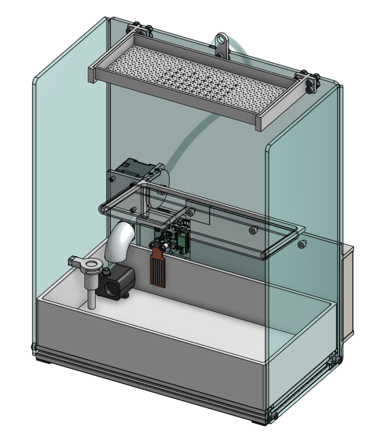
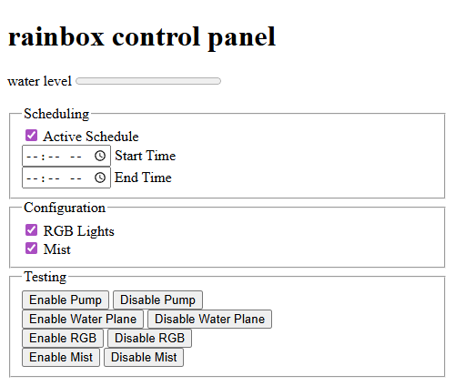
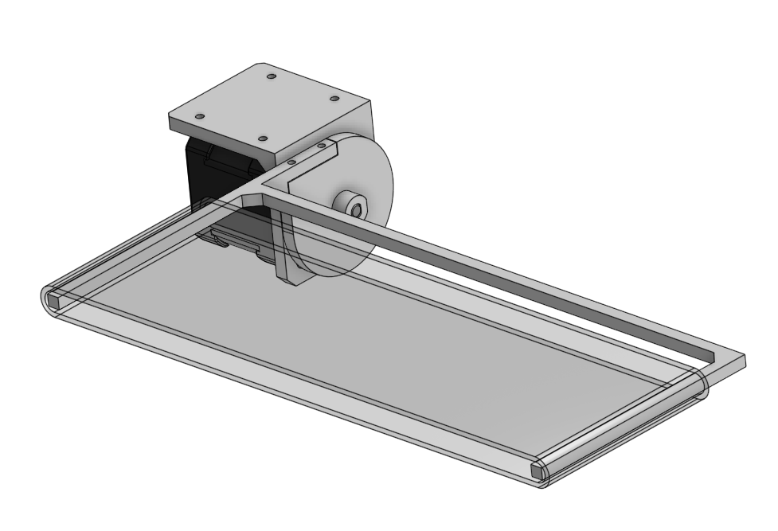
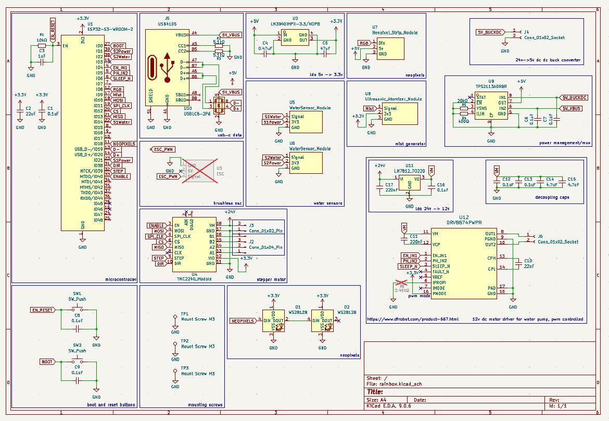
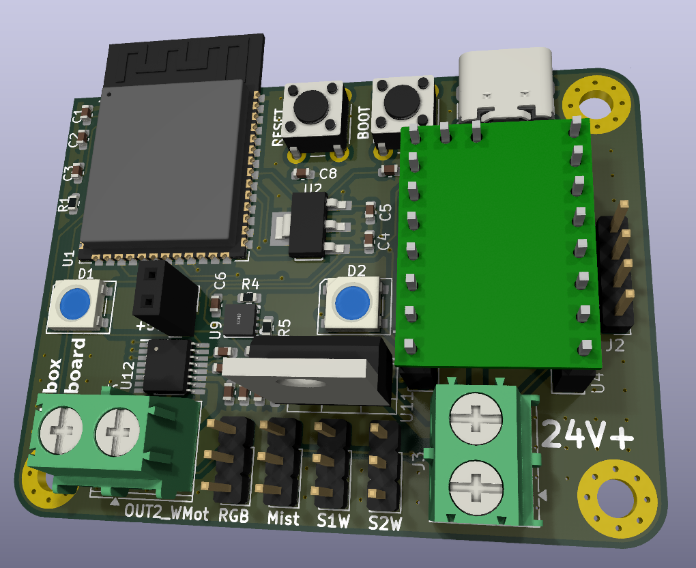
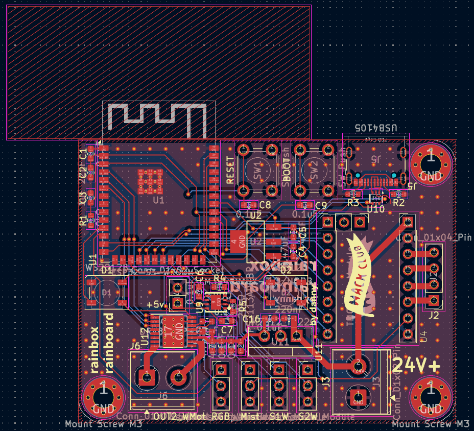

# Rainbox - Ambient Rain Sound Generator

An ambient sound device that is designed to fit on your nightstand. It is based on the esp32 and is super hackable.

* Makes variable rain with different sounds
* Helps with sleep disorders (insomnia, etc.)
* Creates a mist
* Wi-Fi controllable

## Purpose

Rain is something relaxing to listen to, and being able to hear it at night brings a greater quality to sleep. Not only does this have more features than those small rain devices seen on temu, this actually makes rain that is more audible and realistic, as well as coming with a bunch of more features.

## Webpanel Control

The Rainbox can be controlled through its webpanel that is hosted on its own AP or connected to WiFi.

## Mechanical Features

* Quiet submersed water pump that is speed controlled
* A water plane that makes water droplets ricochet off to make more unique noises
* Upper rain tank features hole diameters optimized for various water droplet sizes

### Stepper/Water Plane

A stepper motor directly controls the angle of a plastic/rubber sheet. It is a lightweight design that makes a alternative to where water droplets can land, and ultimately make more unique sounds. 

### CAD

You can find the entire cad [here](https://cad.onshape.com/documents/e948a9a578129b2d9b3c44f2/w/f33f1e86b2b45cf8b68328c5/e/03b493761ac4f752afa24087?renderMode=0&uiState=69d3140726bf52135ed22ca7).

## PCB Features

* Two RGB leds that can shine through the mist for ambience
* Can control a water atomizer to create mist
* Support for a external neopixel led strip
* Water level sensor support for closed loop control of the water pump
* TMC2240 stepper controller for StealthChop2™ support, making super quiet steps
* Super compact board with easy access to boot/reset buttons and usb-c

### Schematics

### PCB

## BOM

You can view the interactive BOM [here!](https://docs.google.com/spreadsheets/d/10gB80Lu2tYKqtstPC31-ZahqdRdbqbskEyKegbtCWHs/edit?usp=sharing) The total is around <250 USD.

